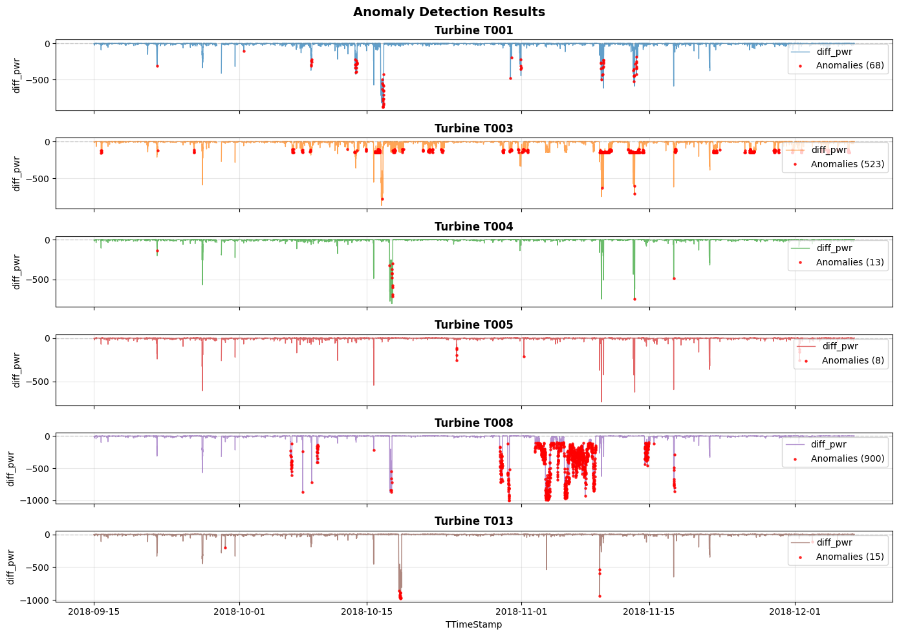

# Wind Turbine Performance Analysis & Anomaly Detection

## Project Overview

This repository contains a comprehensive data quality assessment, performance baseline analysis, and anomaly detection system for wind turbine time series data. The analysis focuses on identifying operational anomalies, establishing performance baselines, and proposing scalable monitoring solutions.

---

## Table of Contents

- [Project Structure](#project-structure)
- [Analysis Questions](#analysis-questions)
  - [1. Data QA/QC](#1-Data--QA/QC)
  - [2. Performance Baseline & Anomaly Detection](#2-performance-baseline--anomaly-detection)
  - [3. Data-Driven Root Cause Hypotheses](#3-data-driven-root-cause-hypotheses)
  - [4. Monitoring Proposal for Azure/Databricks](#4-monitoring-proposal-for-azuredatabricks)
  - [5. Code Quality & Documentation](#5-code-quality--documentation)
  - [6. Presentation](#6-presentation)

---

## Project Structure
Main project expands on the jupyter notebook used in :  [data exploration notebook](./jupyter_explore/data_exploration.ipynb)
This project aim to use a small dataset of 1 wind farm operation in a short timeframe, to illustrate how candidate walk through process of building a power generation anomaly analysis.

Tool functions are located at: [data processing, analysis and illustration tools](./src/)

## 1-Data--QA/QC

Main data QA/QC focuses on the following:
- read in and ensure timestamp reads as datetime format for proper timeseries analysis later.
- ensure data types complies to each column unit types and values match.
- assess total time span, missing timestamp samples and remove duplicates (use first sample).
- fill timestamp gaps for better illustration on data exploration. Use Null value for other columns when timestamp gaps encountered. (group by Turbine ID).

See file : [data clean and check tools](./src/data_checker_clean.py)

## 2-performance-baseline--anomaly-detection

The power generation performance based detection is based on 2 columns: "Grd_Prod_Pwr_Avg" and "Grd_Prod_PsblePwr_Avg". Which are deam the "Actual power produced to grid" and "expected power from all turbine operation specs and measured wind speeds".
The detection method calculates a difference of "Grd_Prod_Pwr_Avg" and "Grd_Prod_PsblePwr_Avg" on each turbine through timestamps.
Then, the logic used to mark the anomaly is as below:
employs a two-stage sequential approach:

1. **Stage 1: Absolute Threshold Check**
   - Flag records where `|Grd_Prod_Pwr_Avg-Grd_Prod_PsblePwr_Avg| > threshold`
   
2. **Stage 2: Cross-Turbine Deviation Check**
   - For records passing Stage 1, compare against median absolute deviation (MAD) across all turbines at the same timestamp
   - Flag if deviation exceeds threshold (e.g., 2.5 MAD)

Based on data exploration, the difference between Actual and Expected power generated can be indicative of the anomalies in asset power generations:

Using the difference, on each turbine and each timeseries during the time span, the detection operate on the logic described above to mark the anomalies.
