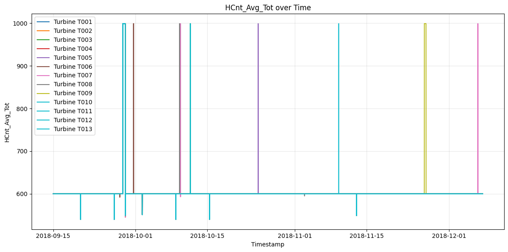

# Wind Turbine Performance Analysis & Anomaly Detection

## Project Overview

This repository contains a comprehensive data quality assessment, performance baseline analysis, and anomaly detection system for wind turbine time series data. The analysis focuses on identifying operational anomalies, establishing performance baselines, and proposing scalable monitoring solutions.

---

## Table of Contents

- [Project Structure](#project-structure)
- [Analysis Questions](#analysis-questions)
  - [1. Data QA/QC](#1-Data--QA/QC)
  - [2. Performance Baseline & Anomaly Detection](#2-performance-baseline--anomaly-detection)
  - [3. Data-Driven Root Cause Hypotheses](#3-data-driven-root-cause-hypotheses)
  - [4. Monitoring Proposal for Azure/Databricks](#4-monitoring-proposal-for-azuredatabricks)
  - [5. Code Quality & Documentation](#5-code-quality--documentation)
  - [6. Presentation](#6-presentation)


---

## Project Structure
Main project expands on the jupyter notebook used in :  [data exploration notebook](./jupyter_explore/data_exploration.ipynb)
This project aim to use a small dataset of 1 wind farm operation in a short timeframe, to illustrate how candidate walk through process of building a power generation anomaly analysis.

Tool functions are located at: [data processing, analysis and illustration tools](./src/)

## 1-Data--QA/QC

Main data QA/QC focuses on the following:
- read in and ensure timestamp reads as datetime format for proper timeseries analysis later.
- ensure data types complies to each column unit types and values match.
- assess total time span, missing timestamp samples and remove duplicates (use first sample).
- fill timestamp gaps for better illustration on data exploration. Use Null value for other columns when timestamp gaps encountered. (group by Turbine ID).

See file : [data clean and check tools](./src/data_checker_clean.py)

## 2-performance-baseline--anomaly-detection

The power generation performance based detection is based on 2 columns: "Grd_Prod_Pwr_Avg" and "Grd_Prod_PsblePwr_Avg". Which are deam the "Actual power produced to grid" and "expected power from all turbine operation specs and measured wind speeds".
The detection method calculates a difference of "Grd_Prod_Pwr_Avg" and "Grd_Prod_PsblePwr_Avg" on each turbine through timestamps.
Then, the logic used to mark the anomaly is as below:
employs a two-stage sequential approach:

1. **Stage 1: Absolute Threshold Check**
   - Flag records where `|Grd_Prod_Pwr_Avg-Grd_Prod_PsblePwr_Avg| > threshold`
   
2. **Stage 2: Cross-Turbine Deviation Check**
   - For records passing Stage 1, compare against median absolute deviation (MAD) across all turbines at the same timestamp
   - Flag if deviation exceeds threshold (e.g., 2.5 MAD)

Based on data exploration, the difference between Actual and Expected power generated can be indicative of the anomalies in asset power generations:


Using the difference, on each turbine and each timeseries during the time span, the detection operate on the logic described above to mark the anomalies.


Detection details as table can also be exported for dashboard or reporting purposes.

## 3-data-driven-root-cause-hypotheses

To check the reported anomalies and their possible causes, several cross referencing plotting may need manual review.
For example, chosen a few time frames, there may either be issues from:
- need to first check data completeness during the high anomalies, usually just cross reference `HCnt_Avg_Tot` column.
Whilst in the step of time gaps filling and checks, I had fill null to the missing time gaps span, we can use a fill null strategy to have a clear look on when are the times data missing occurred. And can plot by turbines to see missing peirods on each turbine.
 
- counters value missing, turbine operation not reporting. Can usually reference such period based on `HCnt_Avg_TrbOk` column.
- curtailment by the grid, can reference `Grd_Sets_ActPwr_ReferenceValue10Min` column.
- turbine male function. Can reference `Gen_Bear_Temp_Avg` column.

## 4-monitoring-proposal-for-azuredatabricks

The processing flow and detection/monitoring can be cleaned up and automated into deployed pipeline. Using below architecture:
#### 4.1 Proposed Architecture (Databricks)
```
┌─────────────────┐
│   Data Sources  │
│  (SCADA, IoT)   │
└────────┬────────┘
         │
         ▼
┌─────────────────────────────────────┐
│   Azure Event Hubs / IoT Hub        │
│   (Real-time data ingestion)        │
└────────┬────────────────────────────┘
         │
         ▼
┌─────────────────────────────────────┐
│   Azure Databricks                  │
│                                     │
│   ┌─────────────────────────────┐   │
│   │  Bronze Layer (Raw Data)    │   │
│   └──────────┬──────────────────┘   │
│              ▼                      │
│   ┌─────────────────────────────┐   │
│   │  Silver Layer (Cleaned)     │   │
│   │  - Deduplication            │   │
│   │  - Missing value handling   │   │
│   │  - Timestamp validation     │   │
│   └──────────┬──────────────────┘   │
│              ▼                      │
│   ┌─────────────────────────────┐   │
│   │  Gold Layer (Analytics)     │   │
│   │  - Performance metrics      │   │
│   │  - Anomaly detection        │   │
│   │  - Aggregations             │   │
│   └─────────────────────────────┘   │
└────────┬────────────────────────────┘
         │
         ▼
┌─────────────────────────────────────┐
│   Azure Synapse Analytics / Delta   │
│   (Data Warehouse)                  │
└────────┬────────────────────────────┘
         │
         ├──────────────────┬──────────────────┐
         ▼                  ▼                  ▼
┌─────────────────┐ ┌──────────────┐ ┌─────────────────┐
│  Power BI       │ │  ML Models   │ │  Alert System   │
│  (Dashboards)   │ │  (Predictive)│ │  (Email/SMS)    │
└─────────────────┘ └──────────────┘ └─────────────────┘
```
#### 4.2 Proposed Architecture(Azure Cloud Services)
```
┌─────────────────────────────────────────────────────────────────────────┐
│                           DATA SOURCES                                  │
│  ┌──────────────┐  ┌──────────────┐  ┌──────────────┐                   │
│  │ SCADA System │  │  IoT Sensors │  │ Weather APIs │                   │
│  └──────┬───────┘  └──────-┬──────┘  └──────--┬─────┘                   │
└─────────┼──────────────────┼──────────────────┼─────────────────────────┘
          │                  │                  │
          └──────────────────┴──────────────────┘
                             │
                    ┌────────▼────────────┐
                    │   Azure IoT Hub /   │
                    │   Event Hubs        │
                    │   (Ingestion)       │
                    └────────┬────────────┘
                             │
          ┌──────────────────┴──────────────────┐
          │                                     │
    ┌─────▼──────┐                    ┌────────▼────────┐
    │Azure Stream│                    │  Batch Files    │
    │ Analytics  │                    │ (Blob Storage)  │
    │ (Real-time)│                    └────────┬────────┘
    └─────┬──────┘                             │
          │                                    │
          └──────────────────┬─────────────────┘
                             │
                    ┌────────▼────────────────────────────┐
                    │   Azure Data Factory (ADF)          │
                    │   - Pipeline Orchestration          │
                    │   - Data Flows (ETL)                │
                    │   - Scheduling                      │
                    └────────┬────────────────────────────┘
                             │
          ┌──────────────────┼──────────────────┐
          │                  │                  │
    ┌─────▼─────┐      ┌────▼─────┐      ┌────▼────-─┐
    │  Bronze   │      │  Silver  │      │   Gold    │
    │  Layer    │──────►  Layer   │──────►  Layer    │
    │ (Raw)     │      │ (Cleaned)│      │(Analytics)│
    │ Parquet/  │      │ Parquet/ │      │ Parquet/  │
    │ Delta     │      │ Delta    │      │ Delta     │
    └───────────┘      └──────────┘      └──────────-┘
          │                  │                  │
          └──────────────────┴──────────────────┘
                             │
                    ┌────────▼────────────────┐
                    │  Azure Synapse          │
                    │  Serverless SQL Pool    │
                    │  (Query Layer)          │
                    └────────┬────────────────┘
                             │
          ┌──────────────────┼──────────────────┬──────────────┐
          │                  │                  │              │
    ┌─────▼──────┐    ┌─────▼──────┐    ┌─────▼──────┐  ┌───▼────┐
    │  Power BI  │    │   Logic    │    │   Azure    │  │  API   │
    │ Dashboards │    │   Apps     │    │  Functions │  │ Mgmt   │
    │            │    │ (Alerts)   │    │   (ML)     │  │        │
    └────────────┘    └────────────┘    └────────────┘  └────────┘
```

#### 4.3 Proposed Dashboarding
The automation of near-real time figures illustrated above can be deployed and published to a BI tool (e.g. Power BI, or Tableau).
Where manual confirmation of warning can be access.


However, the manual causual attribution done in the jupyter notebook may be only a small subset of cross refrences that shell be automated in a more advanced way. Maybe some more intelligent Machine learning model can be trained and use to inference where the causes and what probability they are. And also automatically plot out some figures for human confirmation.
For a more data-generic approach, we may need to train a ML model, using past 2-5 years of historical data, cross refrence values below with labeled, confirmed alarms/events data. To automatically determine the cause of power generation anomalies. (Not vialble in current dataset)

possible cross reference column list:
- overall data availability:
`HCnt_Avg_Tot` 
- turbine health:
`Gen_Bear_Temp_Avg`
`HCnt_Avg_TrbOk`
- External weather factors:
`Amb_WindSpeed_Max`
`Amb_Temp_Avg`
- Grid curtailment:
`Grd_Sets_ActPwr_ReferenceValue10Min`
